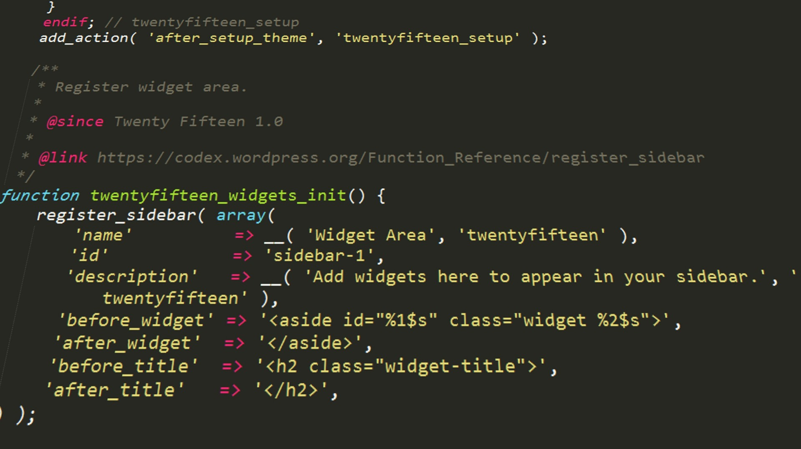

<!DOCTYPE html>
<html lang="en">
<head>
     <meta charset="UTF-8">
     <meta name="viewport" content="width=device-width, initial-scale=1.0">
     <title>RUBEL</title>
</head>
<body>

<h1>Hello Everyone</h1>
<h2>WELCOME TO YOUR FUTURE GARAGE</h2>
<h3>YOUR FUTURE IS HERE</h3>
<h5>Introduction</h5>

A future garage is no longer just a space to park vehicles—it’s a smart, high-tech hub designed for modern living. Integrated with IoT (Internet of Things), artificial intelligence, and automation, the garage of the future offers features like voice-controlled lighting, automatic door systems, security cameras with facial recognition, and even built-in electric vehicle charging stations. These advanced garages can be controlled remotely via smartphone apps, allowing homeowners to monitor access, manage energy use, and enhance security. As homes become smarter, the garage evolves into an essential, connected space that blends functionality, sustainability, and convenience.

WordPress is a powerful, user-friendly, and flexible content management system (CMS) used for building websites and blogs. Originally launched as a blogging platform, it has evolved into a full-featured tool that powers millions of websites worldwide. With its vast library of themes, plugins, and customization options, WordPress allows users — from beginners to developers — to create anything from simple blogs to complex e-commerce sites. It is open-source, constantly updated, and supported by a large community, making it one of the most popular website-building platforms in the world.

</body>
</html>
